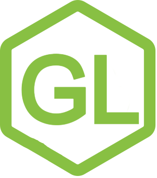
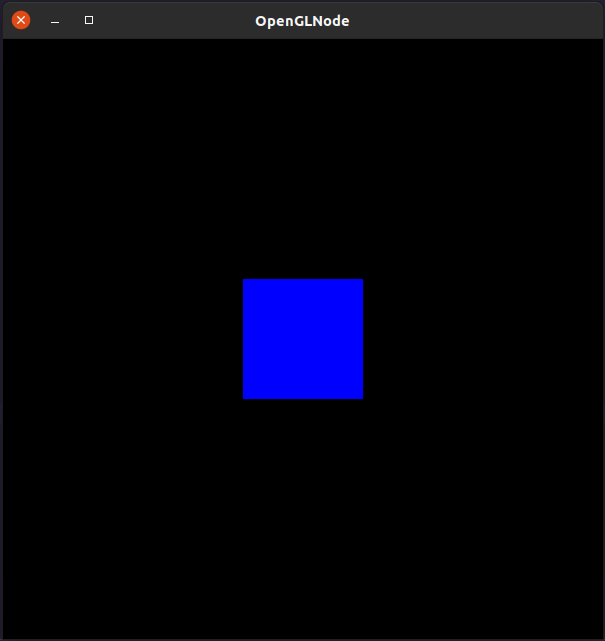

<p align="center">
  
</p>

# NodeGL - OpenGL bindings for Node.JS

This project ports OpenGL C/C++ core calls to Node.JS using N-API.
All callable functions in `gl.h` are binded, including
functions that depend on pointers or non-javascript sized variables
such as float, short and byte.
This is possible by using the Buffer object of Node, which exports its
data as a pointer, unlike a normal JS object or JS arrays (with getters).

# Installing

> Warning: For now, the package cannot be downloaded because I'm disputing the 'nodegl' package name. Currently, this name is a reserved (squatted) package by another user. I already tried to contact the owner and submitted a dispute for NPM support review.
>
> When the dispute is resolved, I will publish this package for download on NPM, meanwhile you can download and build it using the `build` script.
<!--
Using Npm:
```
npm install nodegl
```
Using Yarn:
```
yarn add nodegl
``` -->

# Usage

This package focuses on having only OpenGL bindings, GLUT or GLFW are not included, so you
will need some context initializer. The example below uses a [GLFW port](https://github.com/Reon90/glfwJS) that appears on the ports list of the library's website.

```javascript
// Import Libs
const glfw = require("glfw-n-api");
const gl = require("nodegl");
// Setup Code
async function main() {
	// Init GLFW
	if (!glfw.glfwInit()) {
		glfw.glfwTerminate();
		process.exit(1);
	}
	// Define Constants
	const WINDOW_WIDTH = 600;
	const WINDOW_HEIGHT = 600;
	// Create Window
	const window = glfw.glfwCreateWindow(
		WINDOW_WIDTH,
		WINDOW_HEIGHT,
		"OpenGLNode",
		null,
		null
	);
	if (!window) {
		glfw.glfwTerminate();
		process.exit(1);
	}
	// Get Buffer Size
	glfw.glfwSetFramebufferSizeCallback(window, (window, fbW, fbH) => {
		gl.glViewport(0, 0, fbW, fbH);
		gl.glMatrixMode(gl.GL_PROJECTION);
		gl.glLoadIdentity();
	});
	// Set Current GL Context
	glfw.glfwMakeContextCurrent(window);
	// Pre Loop
	gl.glClearColor(0.0, 0.0, 0.0, 1.0);
	gl.glMatrixMode(gl.GL_PROJECTION);
	gl.glLoadIdentity();
	gl.glOrtho(-15.0, 15.0, -15.0, 15.0, -15.0, 15.0);
	// Main
	while (!glfw.glfwWindowShouldClose(window)) {
		// Check Window Events
		glfw.glfwPollEvents();
		// Clear the screen
		gl.glClear(gl.GL_COLOR_BUFFER_BIT);
		// Draw a blue square
		gl.glBegin(gl.GL_QUADS);
		gl.glColor3d(0.0, 0.0, 1.0);
		gl.glVertex3d(-3.0, -3.0, 0.0);
		gl.glVertex3d(3.0, -3.0, 0.0);
		gl.glVertex3d(3.0, 3.0, 0.0);
		gl.glVertex3d(-3.0, 3.0, 0.0);
		gl.glEnd();
		// Draw - End
		glfw.glfwSwapBuffers(window);
		gl.glFlush();
	}
	// Deallocate GLFW Context
	glfw.glfwTerminate();
	// Exit Program
	process.exit(0);
}
// Start
main();
```
Running the code above gives:

<p align="center">
  
</p>

# License
This package is licensed under MIT License. You can see more about it [here](./LICENSE.md)
